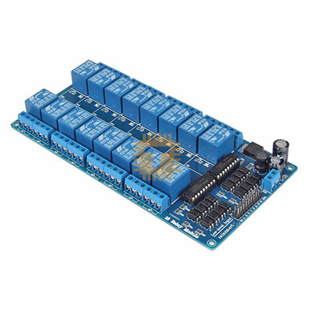
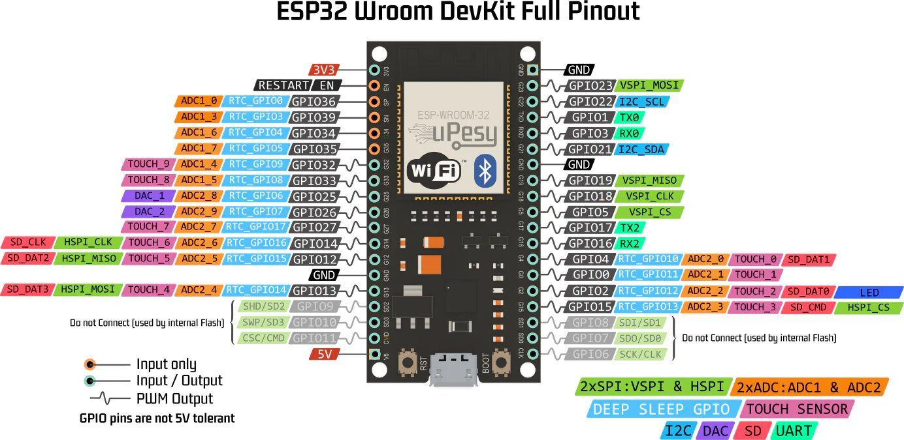
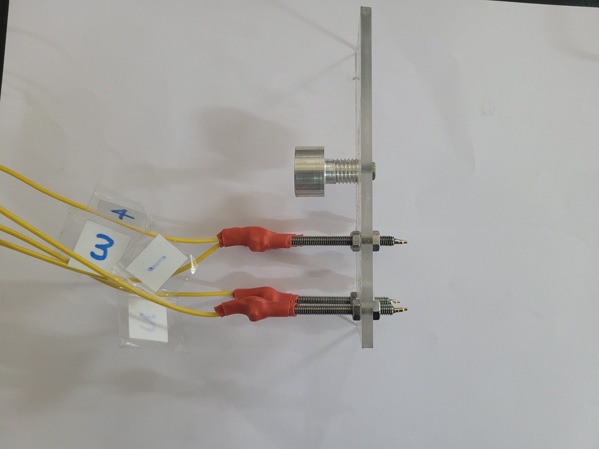
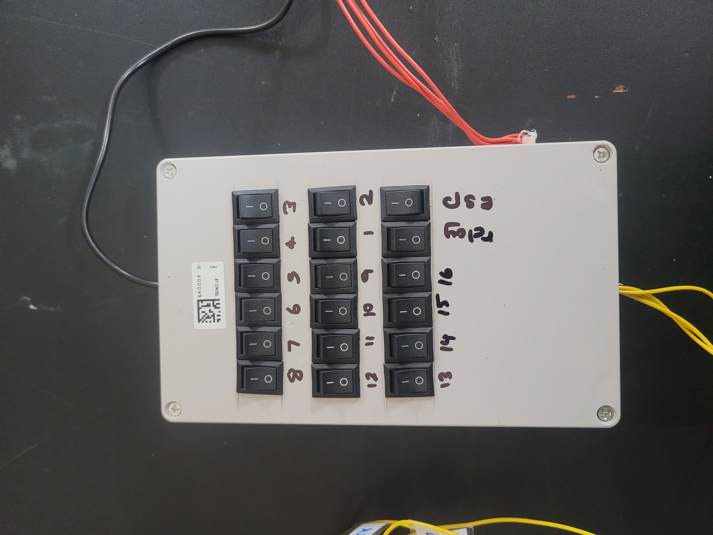

# 4-probe-device
Building a combination create machine for four probe measurements
# Building a Combination Create Machine for Four-Probe Measurements

## Author
S W D K R M Manamendra  
Date: 12th August 2024

## Abstract
This project describes the development of an automated four-probe measurement device for efficient sheet resistance evaluation of thin conductive materials. Using an ESP32 microcontroller, a 16-channel relay module, and a web-based Wi-Fi interface, the system automates probe reconfiguration to reduce manual intervention. Integrating the Van der Pauw and four-probe methods, the device ensures precise, repeatable measurements, supporting advancements in semiconductors, photovoltaics, and flexible electronics.

---

## Introduction

### Importance of Sheet Resistance Measurements
Sheet resistance (\(R_s\)) measures the electrical performance of thin films, expressed in ohms per square (\(\Omega/\square\)). Accurate measurements are critical for applications in semiconductors, photovoltaics, and flexible electronics.

### The Four-Probe Technique
The four-probe method accurately measures resistivity by:
1. Passing current through outer probes and measuring voltage across inner probes.
2. Minimizing contact resistance for precise readings.

Formula:  
\[
\rho = \frac{\pi s}{\ln(2)} \left(\frac{V}{I}\right) F
\]
where \(s\) is probe spacing, \(V/I\) is measured resistance, and \(F\) is the correction factor.

### The Van der Pauw Method
This method measures sheet resistance for arbitrarily shaped samples using four edge contacts. It calculates \(R_s\) using:  
\[
e^{-\pi R_A / R_s} + e^{-\pi R_B / R_s} = 1
\]

### Research Problem
Manual reconfiguration for four-probe measurements is time-consuming and prone to probe failures. This project automates re-wiring to improve accuracy, reliability, and scalability.

---

## Methodology

### Hardware Components
- **ESP32 Microcontroller:** Controls relay modules and offers Wi-Fi-based remote control.
- **16-Channel Relay Module:** Switches probes for different configurations.
- **Probes:** Managed through relays to establish specific configurations.
- **Wi-Fi Network:** Enables remote operation and stable connectivity.

### System Design
1. **Relay Configuration:** Each ESP32 GPIO pin connects to a relay controlling a probe.
2. **Wi-Fi Interface:** A web server hosted on the ESP32 provides remote control.
3. **Switching Logic:** Predefined configurations activated via a web interface.

### System Workflow
1. Power on and connect the ESP32 to Wi-Fi.
2. Access the web interface to select probe configurations.
3. ESP32 switches relays to activate probes for measurements.
4. Measure sheet resistance in the selected configuration.

---

## Results

### System Features
- Automation minimizes manual re-wiring.
- Web interface simplifies control.
- Reliable switching reduces probe failure.

### Images
1. **16-Channel Relay Module:**  
    

2. **ESP32 Microcontroller:**  
   

3. **Four Probes for Measurements:**  
   

4. **Controller unit:**  
   

---

## Challenges and Solutions
- **Probe Failures:** Automated switching eliminates frequent manual re-wiring.
- **Network Stability:** Dual Wi-Fi connections ensure consistent performance.

---

## References
1. L. J. van der Pauw, *A Method for Measuring Specific Resistivity and Hall Effect of Discs of Arbitrary Shape*.
2. D. K. Schroder, *Semiconductor Material and Device Characterization*.
3. ASTM, *Standard Test Method for Measuring Resistivity of Semiconductors*.

---
